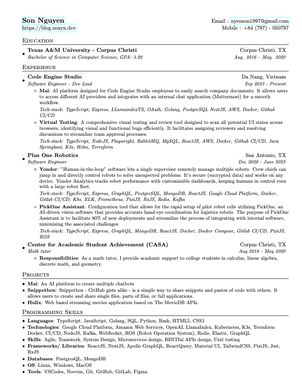

# Overview

My resume written in LaTex.

`resume.tex` can be edit and modify with [Overleaf](https://www.overleaf.com/)

# Use

## `resume.tex` --> `resume.pdf`

```
docker build -t latex:latest .
docker run --rm -i -v "$PWD":/data latex pdflatex resume.tex
```

# Resume


